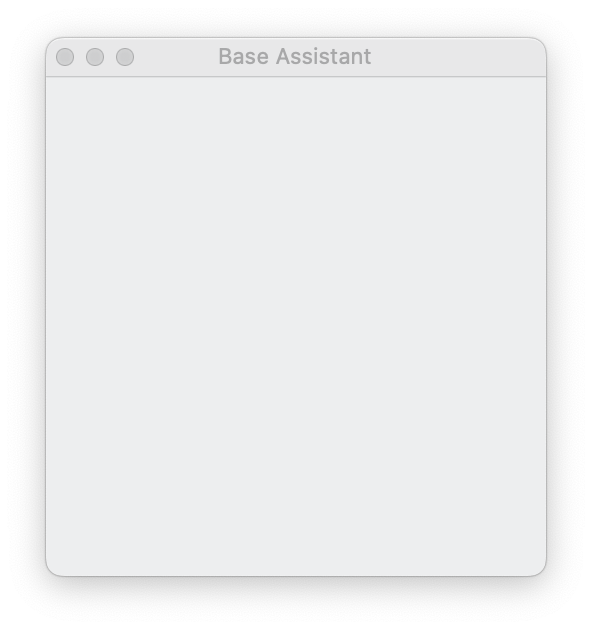
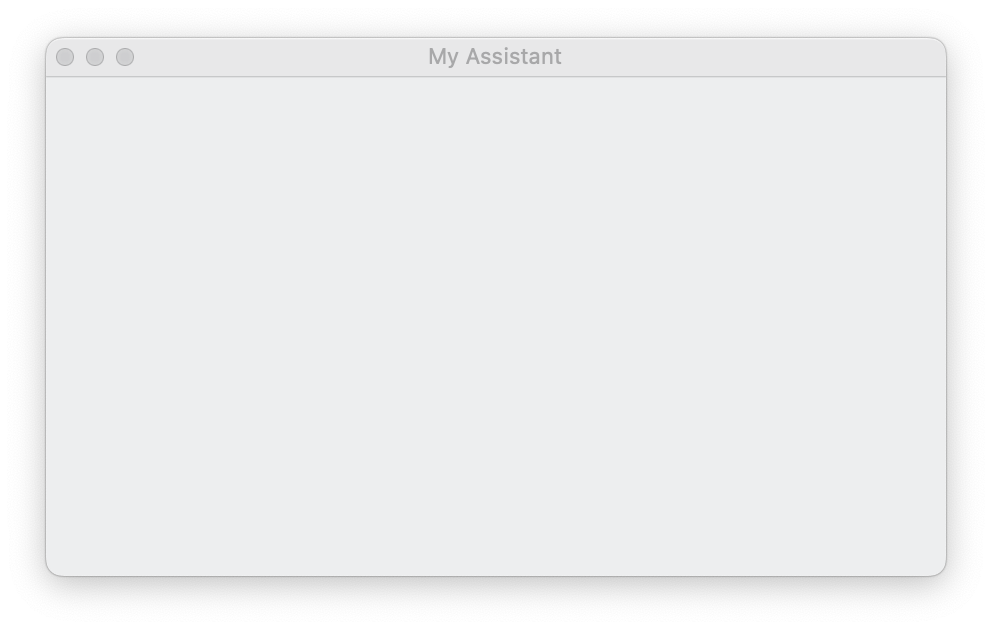
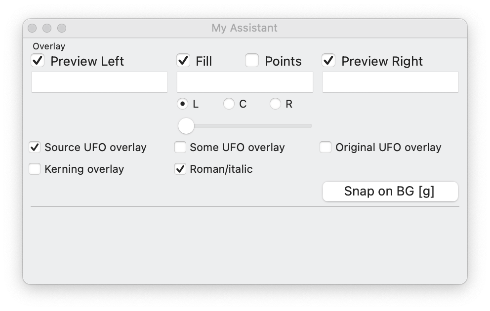

# Getting started with TYPETR-Assistants

The current structure of creating a project Assistant is the making of two new classes that inherit from library classes. This way a range of functions is already implemented. 

From a pure software-development point of view there may be more sustainable ways to implement these functions, but inheriting classes is a very practical and flexible way to bring the functions together.

The functions are organized in separated module classes. E.g. there is a module that takes care of spacing and kerning. Another module handles the automatic placement of anchors. And another one knows how to convert between Quadratic and Bezier curves.

During the development of the design process, modules can simply be added or removed from a project assistant, if the stage of the process requires that. 

Each Assistant works on a local set of UFO/ files. In order to detect where they are, an Assistant needs to find at least one open UFO font. *(This limitation is likely to be solved in future implementations)*

**Due to possible incompatibilities in indenting white space, it is best not to copy/paste code from this MarkDown file. Instead, use the intermediate sources that are available in the myAssistants/ directory.**

### Warnings

Since Assistant are ongoing development, some warnings are necessary:

* Assistants do not work very well if there are any UFOs are opened from other projects, because it won’t be able to find their **MasterData** descriptions.
* If missing **MasterData** or **GlyphData** are found, close RoboFont and add these records to the sources first.
* In case UFO masters are renamed, make sure to change the corresponding names in the **MASTER_DATA** as well.
* Assistants try to keep track of opened fonts in preference of UFO fonts that are opened in the background. However, RoboFont sometimes gets confused, e.g. in the case an [Update] is done. Best is so quit RoboFont or at least close the Assistant window and then start the Assistant again. 

In all these cases, make sure to backup your UFO files. 

**Using Assistant code in production mode, while it is under development offers many advantages and opportunities, but it is also dangerous, “living on the edge”. TYPETR and TypeLab-Club has no responsibility to any damage to your work or UFO’s, but we are available of course to assist recovery.**

## Getting started with MyAssistant-001.py

* Copy the file *MyAssistant-001.py* to your own local repository directory (e.g. *MyProject/*) that also contains a directory with UFO files (e.g. in *ufo/*) and rename it to *MyAssistant-001.py*
* Make sure that this respository directory *MyProject/* is sibling to the TYPETR-*Assistants* diredctory. This way we can find the libraries by *../TYPETR-Assistants/assistantLib/*
* The 3 digits in the *MyAssistant-001.py* file name is a version number. Since working on the Assistant is an ongoing process during a project, you want to be able to got back to previous, other than the versioning of GitHub. Working together with a group of designers, it is clear which version is the latest and which is under beta-development.
* Open the new *MyAssistant-001.py* in RoboFont and open 

For the sake of this demo, we’ll keep *MyAssistant-001.py* in the Assistant repository, so it can access the demo UFO fonts in *ufo-try/*

While we are building the Assistant, the intermediate versions can be found in *myAssistants/*, starting with the current *myAssistants/MyAssistant-001.py*

This first Assistant code contain these lines:

~~~

import sys, os
    
PATHS = ['../TYPETR-TypeLab-Club-Assistants/']
for path in PATHS:
    if not os.path.exists(path):
        print(f'@@@ Locate this file on the top of the project repository and make sure that {path} exists.')
    if not path in sys.path:
        print(f'@@@ Append {path} to sys.path')
        sys.path.append(path)
~~~

Running this in RoboFont shows the following response: 

**@@@ Append to sys.path ../TYPETR-TypeLab-Club-Assistants/**

* This means that RoboFont could find the *TYPETR-Assistants** directory and installed it as a path. From here we can import the needed libraries.
* Running it again does not show anything, as the path connection is already made. Only if you restart RoboFont you will see this response again.

If this works we can proceed to the next version.

## MyAssistant-002.py

Rename (or duplicate) the current source to *MyAssistant-002.py*

**Note that for now, it may be necessary to restart RoboFont, trying a new version. We’ll solve that soon.**

First we’ll make a simple Assistant, that only sypports some overlay functions.

There will be 2 classes: 

* **MyAssistant** For each open UFO font there will be an instance of this RoboFOnt **Subscriber** class. If subscribes to events in RoboFont, such as key stroke and mouse clicks and it knows the right EditorWindow to draw in that belongs to the current font.
* **MyAssistantController** There is just one **Controller** instance, which creates the Assistant window and keeps track of controls and other user interface items. While the UI open, no new Assistant is started. Close it first, if you want to restart a new version.
 
~~~

class MyAssistant(
		Assistant, 
	):
    pass
    	
class MyAssistantController(
		AssistantController, 
	):
	MASTER_DATA = {} 
	PROJECT_PATH = __file__
	ADD_GLOBAL_BUTTONS = False 

if __name__ == '__main__':
   OpenWindow(MyAssistantController)

~~~

###Assistant

Our new **MyAssistant** class always must  inherit from the **Assistant** class, thus implementing everything that the base Assistant needs.

###MyAssistantController

The new **MyAssistantController** class always must inherit from the **AssistantController** class, thus implementing everthing that the base Assistant Controller needs.

* The class variable **MASTER_DATA** is a placeholder for now. It will later contain **MasterData** instances, holding all meta data about UFO masters that the Assistant function parts need.
* The class variable **PROJECT_PATH** tel;s the Assistant what the file path of the project is. This way it can locate all resources by relative path, such as *ufo/* UFO file paths.

Running this code should show no error, it opens an empty small (250 x 250) default Assistant window, with a default title.

We are going to fill the window with a function part in the next version.

## MyAssistant-003.py

Adding function parts to the Assistant requires some additions. We’ll do it step by step for the first one.

Adding the function part “Overlay” needs an import for that sub class.

~~~

from assistantLib.assistantParts.overlay import AssistantPartOverlay

~~~

This class it added as inheriting source for both **MyAssistant** and **MyAssistantController**. From a “clean” programming point of view this is not entiry the best way to solve this, by since these classes a to be used by a limited audience of users it is a pragmatic way to keep all functionality of the function parts such as “Overlay” together and accesseable.

~~~

class MyAssistant(
        Assistant, 
        AssistantPartOverlay, 
	):
~~~

and similar for the **MyAssistantController** class. Since the “Overlay” function part needs more horizontal space, the over window width is changed to 450. It could be an optimization in the future to ask the inplemented function parts for their preferred width and height.

The window title is changed too.

~~~

class MyAssistantController(
        AssistantController,
        AssistantPartOverlay, 
	):    
    W = 450
    H = 250
    
    NAME = 'My Assistant'

~~~

This version of the Assistant now opens a (still empty) larger window.

The reason that no controls of the “Overlay” function part are visible yet, is that we “manually” need to inform the **MyAssistant** and ** MyAssistantController** which of the “Overlay” event we want to use. This process could have been automated (and maybe it partially will in the future), but for now it’s a visible choice to add the list in the project Assistant source. In practice it allows debugging or disabling some functions, e.g. if a better response time of events is needed.

Each of the RoboFont event calls can be subscribed on by function parts.

## MyAssistant-004.py

In order to connect events of RoboFont we add this as class variable to the **MyAssistantController**:

~~~

	# MyAssistantController
	assistantGlyphEditorSubscriberClass = SegoeUIItalicAssistant

~~~

This way the controller knows the class for each **MyAssistant** instance to create, subscribing to event from each EditorWindow. 

~~~

	# MyAssistantController
	BUILD_UI_METHODS = [
		'buildOverlay',
	]
~~~

The class **BUILD_UI_METHODS** contains a list of method names in inherited function parts that need building of their UI components. 

Later we’ll be adding more method names here, when more functions parts get implmentent. 

The UI is building in the order of this list. So this gives the developer control on the order of function part UI’s. The next UI will be placed under the previous one.

Since we just did build the UI without any event subscription, the current version will not respond to any events in the EditorWindow. Nor does the “Overlay” function part do any drawing yet. We’ll add that in the next version.

## MyAssistant-005.py

The basis of Asistants is that they assume the existence of **MASTER_DATA** and **GLYPH_DATA**. Instead of keeping the main parameters of masters and glyphs in the UFO (which my definition nu incomplete), we keep two dictionaries in the project respository:

* **MASTER_DATA** This is a dictionary (key is the UFO file path, value is a **MasterData** instance), that is normally defined by the top project Assistant source.
* **GLYPH_DATA** This is a dictionary (key is the glyph nane, value is a **GlyphData** instance), that is defined as one of the “standard” glyph sets in the Asisstant library. Over time the selection of glyph sets (as TYPETR project) will increase. But for individual projects it is better to define a local dictionary that is imported.

When a new project starts, it is likely that there is already a UFO to start with. In that case it is better to have the Assistant create a new source for **MASTER_DATA** and **GLYPH_DATA**, based on what it can find in the UFO sources in **UFO_PATH**.

Set the **UFO_PATH** to indicate where UFO files can be found. In normal projects this is stypically set to *ufo/*

By setting the **MyAssistantController** class variable **MAKE_MISSING_MASTER_DATA_GLYPH_DATA**, the Assistant is forced to create those files if they are missing. For normal use this value should be **False** avoiding the overwrite of manually edited sources.

~~~

	# MyAssistantController
	# This is where our demo UFO files live. 
	# Change to default ufo/ in your project
	UFO_PATH = 'ufo-try/' 

	# This will create missing MASTER_DATA and GLYPH_DATA sources, 
	# based on UFO files in UFO_PATH
	MAKE_MISSING_MASTER_DATA_GLYPH_DATA = True 

~~~

In order to make the **MyAssistant** respond to any RoboFont event, we’ll need to a some more lists of method names, one for each type of event. 

~~~
	
	# MyAssistant
	INIT_MERZ_METHODS = [ 
	# These get called on opening the Installer window.
		'initMerzOverlay',
	]

~~~

